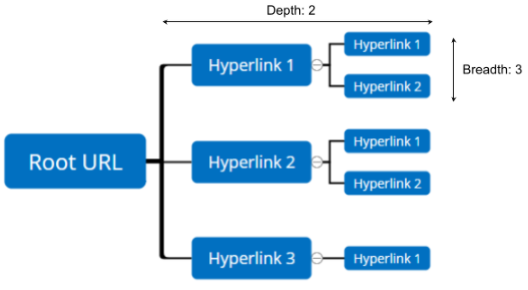

# WebCrawler
Python 3.8

#### Run locally
Check your current Chrome version locally. If older or other version than `99.0.4844.51` go 
to https://chromedriver.storage.googleapis.com/index.html and look for the right version. 
Download and add chromedriver to the `chrome/chrome_driver/<_your_os_sys_>/` folder.
1. Specify chromedriver in `config.yml`. See Configuration section. (Chromedriver from https://chromedriver.storage.googleapis.com/index.html?path=107.0.5304.62/)
2. Make sure that the `requirements.txt` are satisfied. 
3. Run the Crawler my running the `main.py` script 

#### Run in Docker
When running the Crawler in Docker the following command have to be executed: 

- docker-compose up

Running Selenium in Docker requires the usage of the Selenium Grid (More information: https://github.com/SeleniumHQ/docker-selenium).
Containing the selenium-hub, chrome, redis, analysis and main crawler. (https://github.com/SeleniumHQ/docker-selenium/blob/trunk/docker-compose-v3.yml)
The Dockerfiles for the analysis and crawler are located in the `Docker/` folder. The database and wasm files are defined as shared volumes in between the containers. 
Once the services are running the grid information can be observed over `localhost:4444/ui/index.html#/` or `http://localhost:4444/ui/index.html#/sessions`
(optional to run analysis) Open analysis app in local chrome browser with `localhost:5000`

#### Configuration

- `crawler`
  - `start` Set to `False` to only run analysis (default: `True`)
  - `num_threads` To specify parallel threads to make crawling more efficient (default: `1`)
  - `depth` Level of recursive depth (default: `2`)
  - `breadth` Level of recursive breadth (default: `2`) May be set to "max" to use the full breadth 
  - `intern_hyperlinks` Recursive search for same domain names (default: `False`)
  - `extern_hyperlinks` Recursive search for other domain names (default: `True`)
  - `download.default_directory` Location of local download folder in crawler (default: `./wasm_files/`)
- `docker` Docker Configuration    
    - `uri: "http://selenium-hub:4444/wd/hub"` URI for the remote Chromedriver (More information: https://github.com/SeleniumHQ/docker-selenium)
- `chrome` Chrome Configuration    
  - `driver_path` Path to chromedriver when running locally (default: `"./chrome/chrome_driver/win32/chromedriver.exe"`) Could be also set to `/mac64/` or `/linux64/`
  - `max_window_size` (default: `False`)
  - `arguments` Chromedriver option arguments settings
    - List of flags that might be added:
        - `"--force-dev-mode-highlighting"`
        - `"--auto-open-devtools-for-tabs"` 
        - `"--window-size=1920x1080"` 
        - `"--disable-popup-blocking"`
        - `"--mute-audio"`
  - `prefs` Chromedriver preferences 
    - `download.default_directory` Destination directory for downloaded files on selenium node in Docker. Local file location in crawler config (default: `"/home/seluser/"`)
    - `download.prompt_for_download` (default: `False`)
    - `download.directory_upgrade` (default: `True`)
    - `download.download_restrictions` (default: `1`)
    - `safebrowsing.enabled` (default: `True`)
  - `extension`: Chrome Extension Configuration (More info: https://www.wappalyzer.com/)
    - `crx_file_path` Chromedriver setting for extension, path to the **Wappalyzer - Technology profiler** Chrome extension (default: `'./chrome/chrome_extension/extension_6_9_11_0.crx'`)
    - `chrome_extensions_url` Browser url to extensions manager (default: `"chrome://extensions/"`)
    - `background_page` Background Page of the Chrome Wappalyzer Extension with the ID:`gppongmhjkpfnbhagpmjfkannfbllamg` (default: `"chrome-extension://gppongmhjkpfnbhagpmjfkannfbllamg/html/background.html"`)
- `input_file` config for the input file containing the list of websites to be crawled
    - `name` name of the input file (default: `input.txt`)
    - `prefix` optional prefix to add before the websites urls format from input file (default: `"https://"`)  
    - `suffix` optional suffix to add after the websites urls format from input file (default: `""`) 
- `database` config for the SQLite DB (https://www.sqlite.org/index.html)
    - `setup` Boolean value to setup the database and tables 
    - `path` Specifies shared Docker location and name of the database (default: `'/WebCrawler/database/website_data.db'`) 
    - `local_path` Specifies local location and name of the database (default: `'./database/website_data.db'`) 
- `analysis` config to run SELECT queries in flask
    - `start` to run analysis script (default: `True`)
    - `html_file_dict` Folder path (default: `analysis`)
    - `html_file` HTML for analysis (default: `analysis.html`)
    - `url` To run analysis in local host or docker (default: `http://127.17.0.1:5000/`)

#### For Development: Project Structure
###### Main
Initializes Configuration and DatabaseManager. Contains main function to run crawler or analysis. (`./main.py`)
###### Crawler
Main logic of the WebCrawler for the async, recursive scraping and setup of chrome options for the selenium webdriver. (`./crawler.py`)
###### Docker
Specifies the Dockerfiles for the Analysis and the Crawler (`/docker/{analysis, crawler}/Dockerfile`)
###### Utility
Different classes to extract information from website. (`./utility/..`):
- Ad Tracking: Find cookies, tracking pixels, utm links and tag manager
- HTML Tag Extractor: Extract information based on given HTML tag (script and hyperlink data)
- Input Reader: functions to read input URLs and configuration file
- Source Language Analyzer: 
- Wappalyzer API: Get information from Wappalyzer extension background page about used languages, frameworks and libraries
- Web Assembly Analyzer: Find WASM files, Web Assembly functions and information in the source javascript files
- Website Data: Data structure to store found information
###### Database
sqlite3 database (`./database/website_data.db`) and DatabaseManager (`./database/database_manager.py`) to insert website information in database 
###### Chrome
Contains the current chrome drivers (`chrome/chrome_driver/..`) for linux64, mac64 and win32 and the Wappalyzer chrome extension (`./chrome/chrome_extension/..`)
###### Analysis
Flask App to run Analysis (`./analysis/main_analysis.py`) and template for the generated HTML (`./analysis/templates/analysis.html`).
###### Wasm Files
Stores found WASM files (`./wasm_files/..`)
